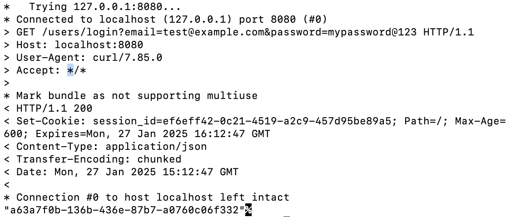

# Application Testing Report

Date: January 27, 2025  
Classification: CONFIDENTIAL

## Overview
This document provides evidence of testing the application's endpoints, including user management and document handling features. The new documents endpoint is tested in *Section 4.1*.

## Environment Setup
- Base URL: http://localhost:8080
- Database: MySQL v9.2
- Testing platform: macOS
- Testing tools: curl, web browser
- Editor: Sublime Text, vim 

## Test Cases and Results

### 1. User Creation
#### 1.1 Creation of User: Test User
```bash
curl -X POST http://localhost:8080/users \
  -H "Content-Type: application/json" \
  -d '{
    "email": "test@example.com",
    "name": "Test User",
    "password": "mypassword@123"
  }'
```

#### Server Response:
```json
"a63a7f0b-136b-436e-87b7-a0760c06f332"
```

#### 1.2 Creation of User: Mallory
```bash
curl -X POST http://localhost:8080/users \
  -H "Content-Type: application/json" \
  -d '{
    "email": "mallory@example.com",
    "name": "Mallory",
    "password": "malicious123"
  }'
```

#### Server Response:
```json
"2be083d3-31a5-4523-813f-0711ea4dec96"
```

#### Database Dump of User Table:


### 2. User Login
#### User Login for User: Test User
```bash
curl -v "http://localhost:8080/users/login?email=test@example.com&password=mypassword@123"
```

#### Server Response:
<!--Response Headers:
 ```
< HTTP/1.1 200 
< Set-Cookie: session_id=ef6eff42-0c21-4519-a2c9-457d95be89a5; Path=/; Max-Age=3600; Expires=Mon, 27 Jan 2025 16:12:47 GMT
```

Browser Session:
-->


### 3. Document Upload
#### Document Upload using Test User as the Logged-in User
```bash
curl -X POST http://localhost:8080/document/upload \
  -H "Content-Type: text/plain" \
  -H "x-file-name: confidential.txt" \
  -H "Cookie: session_id=ef6eff42-0c21-4519-a2c9-457d95be89a5" \
  -d "This is confidential information"
```

#### Server Response:
```json
"68db0718-53a5-4c5e-a9ff-15ca530a7058"
```

#### Database Dump of Document Table:


### 4. Document Lister (*New Endpoint*)
#### 4.1 Document Listing with no Logged-in User Request
```bash
curl -v http://localhost:8080/documents
```

<!--#### Response Headers:
```
< HTTP/1.1 400 
< Content-Type: application/json
< Transfer-Encoding: chunked
< Date: Mon, 27 Jan 2025 15:22:00 GMT
< Connection: close
```
-->
#### Server Response:


#### Remark: 
The test case was successful. The server expects a valid *session_id* in the HTTP request and that was not submitted.

#### 4.2 Document listing with the logged-in user (Test User) request
```bash
curl -v http://localhost:8080/documents \
  -H "Cookie: session_id=ef6eff42-0c21-4519-a2c9-457d95be89a5"
```

<!--#### Response Headers:
```
< HTTP/1.1 200 
< Content-Type: application/json
< Transfer-Encoding: chunked
< Date: Mon, 27 Jan 2025 15:26:23 GMT
< 
* Connection #0 to host localhost left intact
[{"id":"68db0718-53a5-4c5e-a9ff-15ca530a7058","name":"confidential.txt"}]
```
-->
#### Server Response:


#### Remark: 
The test case was successful. The server successfully returns the list of documents (ids and names) uploaded by the logged-in user.

#### 4.3 Document Listing with Different session_id in the User Request
```bash
curl -v http://localhost:8080/documents \
  -H "Cookie: session_id=ab6eff42-0c21-4519-a2c9-457d95be89ab"
```

<!--
#### Response Headers:
```
< HTTP/1.1 401 
< Content-Type: application/json
< Transfer-Encoding: chunked
< Date: Mon, 27 Jan 2025 15:28:59 GMT
```
-->
#### Server Response:


#### Remark: 
The test case was successful. The server successfully yields the 401 error code indicating that the request lacks valid authentication credentials.

## Appendix: Application Execution Trace


